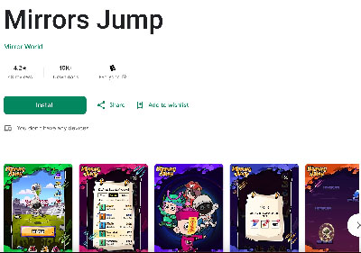

# Mirror World Unity SDK

>Mirror World's Official Unity SDK  

This readme is an article to introduce the SDK and teach you how to integrate it, if you prefer video, you can just click on the following link: https://www.youtube.com/watch?v=Bi8GHO9gmU4

## Getting started
*We have tested our SDK on Unity 2022/Unity 2021/Unity 2020/Unity 2019 and ensured that our demo program can directly generate Android installation packages. Theoretically, higher versions of Unity should also work without problems. If your product is lower than the minimum version we tested, you may need to make some compatibility modifications to the SDK yourself. If you need any help with this, you can also contact us for assistance.*
1. You should have a MirrorWorld developer account,you can register for it at [our official site](https://app.mirrorworld.fun).
2. You need to prepare an APIKey. If you don't have one,you can acquire it following `Home -> Add Project` and create a new project for yourself.

## Import SDK

Download assets [Mirror World Unity SDK](https://github.com/mirrorworld-universe/mirrorworld-sdk-unity/releases).  
Import it to your project, you can drag the unitypackage file to your Unity direction or follow `Assets > Import Package > Custom Package` and select the package you just downloaded.

## Usage
### Configration
#### Config with prefab
Drag and drop the "MirrorSDK" prefab located in the MirrorMarketSDK directory into your initial scene and proceed with the configuration.


Explanation of beyond image:
- Api Key
Input your aky key which requested on https://docs.mirrorworld.fun/ .  
- Debug Mode
If checking this, you could see all the flow and error notice on console.
- Environment
Choose the environment you want to use.
- Debug Email
Using for debug. Please input the email which used to register the API key.
- Chain
Which chain you want to work on.

#### Configration dynamic
We strongly recommend configuring the SDK by dragging and dropping the prefab. However, if you prefer not to do so, you can init Mirror World SDK with the following code:  
```cs
GameObject mirrorObj = new GameObject("MirrorSDK", typeof(MirrorSDK));
string apiKey = "your api key";
MirrorChain chain = MirrorChain.Solana;
bool debugMode = true;
MirrorEnv env = MirrorEnv.Devnet;

MWSDK.InitSDK(apiKey, mirrorObj, chain, debugMode, env);
```

### Login
And then,if you want to call some API of SDK in your app,you should lead users to login first.

1. Call up login page  

If you want him to login(or again), you can use the following code:
```cs
MWSDK.StartLogin((loginResponse) =>
{
    MWSDK.DebugLog("Login result:" + JsonUtility.ToJson(loginResponse));
});
```
StartLogin is a client API, so you don't need to concern about chain.
But for most API, you need to use different instance on different chain.
Normally, they are **MWSDK.chain_name**.
*You can refer to our documentation website to find out which functional module each API belongs to.*

For convinience, we will use Solana as default at following code.

And if you want to do something after the logining is successful,you can pass an action to it as follows code:
```cs
MWSDK.StartLogin((isSuccess)=>{
    if(isSuccess){
        Debug.Log("Login success!");
    }else{
        Debug.Log("Login failed!");
    }
});
```

2. Check if use needs to login.
When a user opens your app, you may want to know whether this user has logged in before,instead of letting him login every time, you can call the following code to know that.

```cs
MWSDK.IsLoggedIn((isLoggedIn) => {
    Debug.Log("If he is logged in:" + isLoggedIn);
});
```

### Open wallet
User may want to check their wallet in your app,you can open their wallet by following code:

```cs
MWSDK.OpenWallet(() => {
    Debug.Log("Wallet logout callback runs!!");
});
```
If you want to do some operation when user clicked logout button in wallet page, passing 'logoutAction' to this function would be ok.

### Confirmation
When we call some API of SDK, you are allowed to pass a param named 'confirmation' to it.
You can use all the confirmation we provide in 'Confirmation' enum. Here is an explanation for every kind of them:
- `Default`: If you pass this kind of confirmation to an API,it will use a default confirmation to handle this call,most of the time,it equals 'Confirmed'.
- `Finalized`: If you use this, API will wait for Solana to confirm the transaction before returning the HTTP response to you.
So the time will be longer more or less.
- `Confirmed`: It is a fairly quick response to the user and is a reasonable promise that the transaction if processed, will be eventually finalized after a certain number of confirmations by the validator network.
- `Processed`: The node will query its most recent block. Note that the block may still be skipped by the cluster.

> Tips:
If you want to obtain the complete information of an on-chain operation, please make sure to use "Finalized." For example, when calling the "MintNFT" method, if you don't use "Finalized," the returned result will not include the "transaction_hash" field.

### Package
You need to do some configuation if you want to package your app.

#### Android
When packaging your Unity project that uses Mirror SDK into an Android APK, you need to configure the Androidmanifest.xml, laucherTemplate.gradle, and gradleTemplate.properties (if applicable). 
[Please refer to this link](./AndroidConfig.md) for detailed instructions.

If you prefer to learn from video, you can click on: https://www.youtube.com/watch?v=ksjQGPsohGU

#### iOS
When packaging your Unity project that uses Mirror SDK into an iOS IPA, you need to manually add the Mirror SDK framework to the build phase of your Xcode project and make a single-line modification to the universal code.  
[Please refer to this link](./iOSConfig.md) for detailed instructions.

## Full API Documentation
You can view the documentation for Mirror World SDK for Mobile on [our Official Documentation Site](https://docs.mirrorworld.fun/unity/unity-api)

## FAQ

#### Q: How do I get started? 
**A:** If you want to experience the effect of our SDK, you can search for the game `Mirrors Jump` in app store, we will always apply our latest SDK to this game.  
But if you want to start learning how to integrate our SDK, you can check [our official demo](https://github.com/mirrorworld-universe/mirrorworld-sdk-unity), you can directly run this project and package it with this project!  
At the same time, you can also refer to the code in it to learn how to call our API, but we still recommend that you read our Readme document first, because that may be the basis for subsequent operations.  


#### Q: I found the source code of the MirrorsJump game, how do I run it? 
A: Actually, MirrorsJump is not only a showcase of our SDK, but also a game that we officially run online, which involves some configuration of passwords, interfaces or third-party SDKs.  
So, if you just want to run MirrorsJump on your computer, we think that’s fine, but if you want to do more operations such as packaging and installing it on a device, that should be very difficult. Therefore, we strongly recommend users to download our SDK-specific demo to get started or do some of their own experiments, this is its address:[github](https://github.com/mirrorworld-universe/mirrorworld-sdk-unity)

#### Q:How do I test the login flow on a computer instead of a mobile device? 
A: Our SDK works on both your computer and your phone.  
You only need to input your parameters on MirrorSDK object well and call `StartLogin` API. Then your Unity editor will use your computer's default browser to open our login page.  
You can choose the way you want to log in.

#### Q:Why does the SDK show that I am not logged in after I complete the login process on my computer?
**A:** First, please make sure that the debug email you have entered on the MirrorSDK GameObject is a valid email address. Then, ensure that your login method matches the debug email you have entered on the MirrorSDK object.  
For example, if I have set the debug email as myaccount0001@gmail.com, you must choose Google login on the pop-up login webpage and select your Google account myaccount0001@gmail.com. After seeing the wallet page, you can close the login webpage, go back to Unity Editor, and click "Logged" button again to verify the login result.  
In reality, you can only use a Google account or Discord account for this entire debug-login process. However, don't worry, users can use any method to log in when accessing on a mobile device.

#### Q:Do Mirror SDK support older versions than Unity 2019?
A: Our testing work has been carried out to the lowest Unity2019 version, but this does not mean that our SDK does not support lower versions than that.  
If you want to use our SDK in lower versions, we believe you can do it. Although we don’t think you won’t encounter any problems, there shouldn’t be any major issues.  
If you don't want to do that by yourself and really need that, please try to contact us, we are confident that we can complete the compatibility work for lower versions for you!  

#### Q: I exported the project as an Android project through Unity, why can’t this project run? 
A: First of all, we suggest you try to see if an empty Unity project exported as an Android project can run normally on your computer.  
If you are sure that the problem is caused by MirrorSDK, please do not hesitate to contact us.  

#### Q: How can I use MirrorSDK to access the network interface of MirrorWorld? 
A: The UnitySDK has implemented almost all of the network interfaces we have. After completing the integration work with UnitySDK, you can directly call them. [The list of interfaces can be found here](https://www.mirrorworld.fun/docs/api-reference/unity).   
Additionally, if you want to implement your own network requests, it is also possible. First, you can refer to [our network API list](https://developer.mirrorworld.fun/). Then, you can use the `MWSDK.GetAccessToken()` interface from UnitySDK to obtain a valid JWT token to implement your own network request to access any of our network APIs. 
Furthermore, if you have any customization requirements, please feel free to contact us at any time.

#### Q: Why do I need to choose which app to return to after completing the operation on the web page popped up by the SDK? I don't like this.
**A:** This might be because you have more than one app from MirrorWorld installed on your device.
Firstly, it's important to understand that our web page redirects back to the app by sending a scheme command. Therefore, when multiple apps have the same scheme name, the system requires you to specify which app to return to.
To address this issue, we recommend using the `MWSDK.SetSchemeName()` method to customize your own scheme name.
Please note that if you use this method, make sure to **keep the scheme configuration in your AndroidManifest.xml file in sync with the customized scheme name**.
