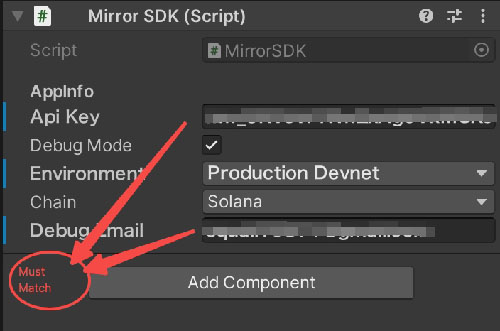

# Mirror World Unity SDK

>Mirror World's Official Unity SDK  

## Getting started
*We have tested our SDK on Unity 2022/Unity 2021/Unity 2020/Unity 2019 and ensured that our demo program can directly generate Android installation packages. Theoretically, higher versions of Unity should also work without problems. If your product is lower than the minimum version we tested, you may need to make some compatibility modifications to the SDK yourself. If you need any help with this, you can also contact us for assistance.*
1. You should have a MirrorWorld developer account,you can register for it at [our official site](https://app.mirrorworld.fun).
2. You need to prepare an APIKey. If you don't have one,you can acquire it following `Home -> Add Project` and create a new project for yourself.

## Import SDK

Download assets [Mirror World Unity SDK](https://github.com/mirrorworld-universe/mirrorworld-sdk-unity/releases).  
Import it to your project, you can drag the unitypackage file to your Unity direction or follow `Assets > Import Package > Custom Package` and select the package you just downloaded.

## Usage
### Configration
#### Config with prefab
Drag and drop the "MirrorSDK" prefab located in the MirrorMarketSDK directory into your initial scene and proceed with the configuration.


Explanation of beyond image:
- Api Key
Input your aky key which requested on https://docs.mirrorworld.fun/ .  
- Debug Mode
If checking this, you could see all the flow and error notice on console.
- Environment
Choose the environment you want to use.
- Debug Email
Using for debug. Please input the email which used to register the API key.
- Chain
Which chain you want to work on.

#### Configration dynamic
We strongly recommend configuring the SDK by dragging and dropping the prefab. However, if you prefer not to do so, you can init Mirror World SDK with the following code:  
```cs
GameObject mirrorObj = new GameObject("MirrorSDK", typeof(MirrorSDK));
string apiKey = "your api key";
MirrorChain chain = MirrorChain.Solana;
bool debugMode = true;
MirrorEnv env = MirrorEnv.Devnet;

MWSDK.InitSDK(apiKey, mirrorObj, chain, debugMode, env);
```

### Login
And then,if you want to call some API of SDK in your app,you should lead users to login first.

1. Call up login page  

If you want him to login(or again), you can use the following code:
```cs
MWSDK.StartLogin((loginResponse) =>
{
    MWSDK.DebugLog("Login result:" + JsonUtility.ToJson(loginResponse));
});
```
StartLogin is a client API, so you don't need to concern about chain.
But for most API, you need to use different instance on different chain.
Normally, they are **MWSDK.chain_name**.
*You can refer to our documentation website to find out which functional module each API belongs to.*

For convinience, we will use Solana as default at following code.

And if you want to do something after the logining is successful,you can pass an action to it as follows code:
```cs
MWSDK.StartLogin((isSuccess)=>{
    if(isSuccess){
        Debug.Log("Login success!");
    }else{
        Debug.Log("Login failed!");
    }
});
```

2. Check if use needs to login.
When a user opens your app, you may want to know whether this user has logged in before,instead of letting him login every time, you can call the following code to know that.

```cs
MWSDK.IsLoggedIn((isLoggedIn) => {
    Debug.Log("If he is logged in:" + isLoggedIn);
});
```

### Open wallet
User may want to check their wallet in your app,you can open their wallet by following code:

```cs
MWSDK.OpenWallet(() => {
    Debug.Log("Wallet logout callback runs!!");
});
```
If you want to do some operation when user clicked logout button in wallet page, passing 'logoutAction' to this function would be ok.

### Confirmation
When we call some API of SDK, you are allowed to pass a param named 'confirmation' to it.
You can use all the confirmation we provide in 'Confirmation' enum. Here is an explanation for every kind of them:
- `Default`: If you pass this kind of confirmation to an API,it will use a default confirmation to handle this call,most of the time,it equals 'Confirmed'.
- `Finalized`: If you use this, API will wait for Solana to confirm the transaction before returning the HTTP response to you.
So the time will be longer more or less.
- `Confirmed`: It is a fairly quick response to the user and is a reasonable promise that the transaction if processed, will be eventually finalized after a certain number of confirmations by the validator network.
- `Processed`: The node will query its most recent block. Note that the block may still be skipped by the cluster.

> Tips:
If you want to obtain the complete information of an on-chain operation, please make sure to use "Finalized." For example, when calling the "MintNFT" method, if you don't use "Finalized," the returned result will not include the "transaction_hash" field.

### Package
You need to do some configuation if you want to package your app.

#### Android

**Switch to Android platform**
Find File -> Build and settings -> Choose Android platform (If you are not) -> Click switch platform button.`

**Edit Androidmanifest.xml**
Find:File->Build and settings->Player Settings->Publishing Settins->Build->Custom Main Manifest

Check it, and you may see the path of this file.Let's edit it.

**Add permission of internet.**
```xml
<uses-permission android:name="android.permission.INTERNET" />
<queries>
    <intent>
        <action android:name="android.intent.action.VIEW" />
        <category android:name="android.intent.category.BROWSABLE" />
        <data android:scheme="https"/>
    </intent>
</queries>
```

**Register this activity**
```xml
<activity
    android:name="com.mirror.sdk.activities.RedirectActivity"
    android:exported="true">

    <intent-filter>
        <action android:name="android.intent.action.VIEW"/>
        <category android:name="android.intent.category.DEFAULT"/>
        <category android:name="android.intent.category.BROWSABLE"/>
        <data android:scheme="mwsdk"/>
    </intent-filter>
</activity>
```

So, the finnaly file would looked as this:
```xml
<?xml version="1.0" encoding="utf-8"?>
<manifest xmlns:android="http://schemas.android.com/apk/res/android"
    xmlns:tools="http://schemas.android.com/tools"
    package="com.mirror.mirrorworld_sdk_android">

    <uses-permission android:name="android.permission.INTERNET" />
    <queries>
        <intent>
            <action android:name="android.intent.action.VIEW" />
            <category android:name="android.intent.category.BROWSABLE" />
            <data android:scheme="https"/>
        </intent>
    </queries>

    <application
        android:allowBackup="true"
        android:dataExtractionRules="@xml/data_extraction_rules"
        android:fullBackupContent="@xml/backup_rules"
        android:icon="@mipmap/ic_launcher"
        android:label="@string/app_name"
        android:networkSecurityConfig="@xml/network_security_config"

        android:roundIcon="@mipmap/ic_launcher_round"
        android:supportsRtl="true"
        android:theme="@style/Theme.Mirrorworldsdkandroid"
        tools:targetApi="31">
        <activity
            android:name=".MainActivity"
            android:launchMode="singleTask"
            android:exported="true">
            <intent-filter>
                <action android:name="android.intent.action.MAIN" />
                <category android:name="android.intent.category.LAUNCHER" />
            </intent-filter>
        </activity>


        <activity
            android:name="com.mirror.sdk.activities.RedirectActivity"
            android:exported="true">

            <intent-filter>
                <action android:name="android.intent.action.VIEW"/>
                <category android:name="android.intent.category.DEFAULT"/>
                <category android:name="android.intent.category.BROWSABLE"/>
                <data android:scheme="mwsdk"/>
            </intent-filter>
        </activity>
    </application>

</manifest>
```

**Edit laucherTemplate.gradle**
Use the same function to open your laucherTemplate.gradle file.
Add this to dependencies:
```xml
implementation 'androidx.browser:browser:1.3.0'
```

So the finnal dependencies may like this:
```xml
apply plugin: 'com.android.application'

dependencies {
    implementation project(':unityLibrary')
    implementation 'androidx.browser:browser:1.3.0'
}
```

**Edit gradleTemplate.properties**
Add these to the end of the file:
```
android.useAndroidX=true
android.enableJetifier=true
```

**Besides, you can refer to Android Document to get more information.**

#### iOS
**Build your xCode project**
Find File->Build and settings->iOS->Switch Platform->Build

**Add Mirror World Framework**
Open the build xCode project.
Select your project root->TARGETS/Unity-iPhone->Build pharses->Copy Files
Change the destination to "Frameworks" and click "+" button to add MirrorWorldSDK.framework to your project.

**Edit UnityAppController.mm**
First, add this import to head of the file:
```swift
#import <MirrorWorldSDK/MirrorWorldSDK-Swift.h>
```

Second, add this to openUrl function:
```swift
[[MirrorWorldSDK share] handleOpenWithUrl:url];
```

So, finnaly your openUrl function may looked like this:
```swift
- (BOOL)application:(UIApplication*)app openURL:(NSURL*)url options:(NSDictionary<NSString*, id>*)options
{
    id sourceApplication = options[UIApplicationOpenURLOptionsSourceApplicationKey], annotation = options[UIApplicationOpenURLOptionsAnnotationKey];

    NSMutableDictionary<NSString*, id>* notifData = [NSMutableDictionary dictionaryWithCapacity: 3];
    if (url)
    {
        notifData[@"url"] = url;
        UnitySetAbsoluteURL(url.absoluteString.UTF8String);
    }
    if (sourceApplication) notifData[@"sourceApplication"] = sourceApplication;
    if (annotation) notifData[@"annotation"] = annotation;

    AppController_SendNotificationWithArg(kUnityOnOpenURL, notifData);
    [[MirrorWorldSDK share] handleOpenWithUrl:url];
    return YES;
}
```

## Full API Documentation
You can view the documentation for Mirror World SDK for Mobile on [our Official Documentation Site](https://docs.mirrorworld.fun/unity/unity-api)

## FAQ

#### Q: How do I get started? 
A: If you want to experience the effect of our SDK, you can search for the game `Mirrors Jump` in app store, we will always apply our latest SDK to this game. 
If you want to start learning how to integrate our SDK, you can visit our [github](https://github.com/mirrorworld-universe/mirrorworld-sdk-unity), you can directly run this project and package it with this project!
At the same time, you can also refer to the code in it to learn how to call our API, but we still recommend that you read our Readme document first, because that may be the basis for subsequent operations.  


#### Q: I found the source code of the MirrorsJump game, how do I run it? 
A: Actually, MirrorsJump is not only a showcase of our SDK, but also a game that we officially run online, which involves some configuration of passwords, interfaces or third-party SDKs. So, if you just want to run MirrorsJump on your computer, we think that’s fine, but if you want to do more operations such as packaging and installing it on a device, that should be very difficult. Therefore, we strongly recommend users to download our SDK-specific demo to get started or do some of their own experiments, this is its address:[github](https://github.com/mirrorworld-universe/mirrorworld-sdk-unity)

#### Q:How do I test the login flow on a computer instead of a mobile device? 
A: Our SDK works on both your computer and your phone.
You only need to input your parameters on MirrorSDK object well and call `StartLogin` API. Then your Unity editor will use your computer's default browser to open our login page.
You can choose the way you want to log in.

#### Q:Why does the SDK show that I am not logged in after I complete the login process on my computer?
A: You need to make sure that the debug email you enter in the MirrorSDK object matches the email and login method you use to log in to https://app.mirrorworld.fun/. 
The debug email should also be the owner of the API key you enter in the MirrorSDK object. 
For example, if you log in with your Google account `myaccount@gmail.com` and get an API key `myaccount-apikey`, you should enter both of them into the MirrorSDK object. After you log in, you should click the “I have logged” button on the panel that pops up from the SDK.
Then you can see the login result on your Unity console.


#### Q:Do Mirror SDK support older versions than Unity 2019?
A: Our testing work has been carried out to the lowest Unity2019 version, but this does not mean that our SDK does not support lower versions than that. 
If you want to use our SDK in lower versions, we believe you can do it. Although we don’t think you won’t encounter any problems, there shouldn’t be any major issues. 
If you don't want to do that by yourself and really need that, please try to contact us, we are confident that we can complete the compatibility work for lower versions for you!
