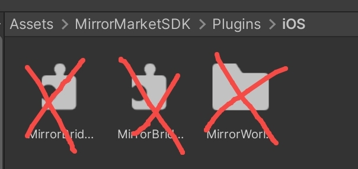
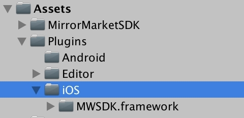
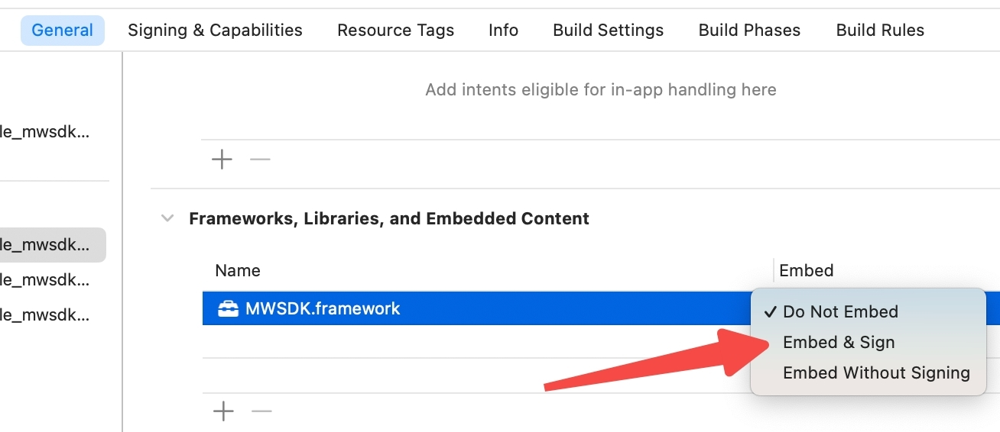
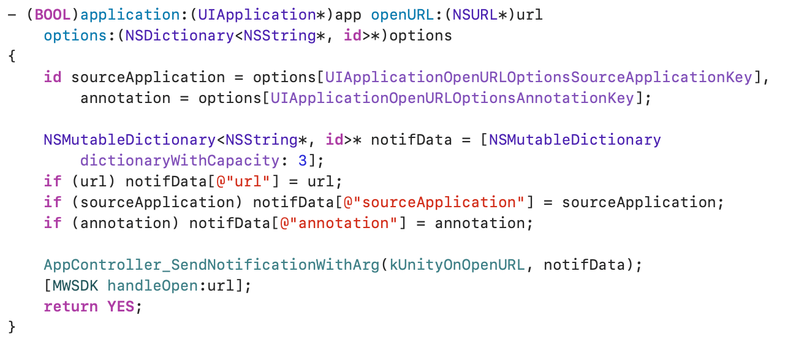

# iOS compat flow
If the version of Unity you are using is lower than 2019, such as Unity2018 or Unity2017, your XCode project may not recognize the framework of ios in MirrorSDK.
Then you need to do some change following this document:
*Note that this framework only supports two functionalities: login and wallet opening. If you require more comprehensive features, please refrain from attempting to use this package. Instead, reach out to us, as we may have alternative solutions to make it compatible with your game version.*

## 1. Delete all files under MirrorMarketSDK/Plugins/iOS
There should are 2 files and a folder, delete them all like the following image:

## 2. Import the compatible ios framework
You can download the framework here:https://github.com/SuQiang2007/compatible_mwsdk_ios/releases/tag/v1.0

Create the path which is: Assets/Plugins/iOS/ and unpack the framework.zip. Final result should be like:

## 3. Build to XCode project
You need to build it after you finish the importing.

## 4. Set the new framework
Select Target->General->Frameworks,Libraies,And Embedded content
Set MWSDK.framework's embed type to Embed&Sign

## 5. Change a bit code
Find UnityAppController.mm and add code:
#include <MWSDK/MWSDK.h>

In the same file, search "openURL" you will find a method, add this before "return YES;":
[MWSDK handleOpen:url];

So finnaly your code will look like this:

## 6. Run XCode project
Now your project should can work well. If not, you can refer to use to get some help.

Thanks again for your support!
